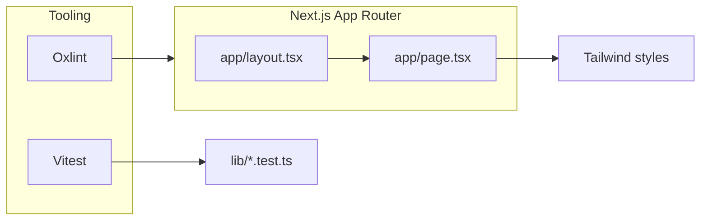

# Next.js portfolio app (Tailwind, Oxlint, Vitest)

## Context

The workspace `[/Users/laramo/LaraMo](/Users/laramo/LaraMo)` is empty, so everything is created from scratch. Next.js docs support `**--no-linter**` so we skip ESLint/Biome and use **Oxlint** instead ([create-next-app CLI](https://nextjs.org/docs/app/api-reference/cli/create-next-app)).

## 1. Scaffold Next.js + Tailwind

Run **non-interactive** `create-next-app` in the repo root (`.`):

- **TypeScript**, **App Router** (`--app`), **Tailwind** (`--tailwind`)
- `**--no-linter`** — no ESLint/Biome boilerplate (avoids duplicating lint with Oxlint)
- `**--yes`** — accept defaults for remaining prompts (or pass explicit flags your CLI version supports, e.g. `--use-npm` / `--use-pnpm` if you want a fixed package manager)

Example shape (adjust package manager flag to taste):

```bash
npx create-next-app@latest . --typescript --tailwind --app --no-linter --yes
```

After generation, confirm: `app/layout.tsx`, `app/page.tsx`, `app/globals.css`, `next.config.ts`, `tsconfig.json`, and Tailwind v4 config. Use React 19 (latest version of React)

## 2. Add Oxlint

- **Dev dependency:** `oxlint` ([npm](https://www.npmjs.com/package/oxlint))
- **Scripts** in `package.json`:
  - `"lint": "oxlint ."`
  - Optional: `"lint:fix"` if you enable fixable rules your Oxlint version supports
- **Config:** add `[.oxlintrc.json](https://oxc.rs/docs/guide/usage/linter.html)` (or the format Oxlint documents for your version) at the project root with sensible defaults for React/TypeScript
- **Scope:** lint `app/`, `components/` (if any), `lib/` — rely on Oxlint defaults to skip `node_modules` / `.next`; add explicit ignores only if the tool still scans build output

**Note:** You will **not** have `@next/eslint-plugin-next` rules; Oxlint is fast and fine for a basic portfolio. If you later need Next-specific lint rules, you can add ESLint alongside Oxlint.

## 3. Add Vitest

Install dev dependencies (typical minimal React/TS stack):

- `vitest`, `@vitejs/plugin-react`, `jsdom`

Add `[vitest.config.ts](vitest.config.ts)` at the repo root:

- `plugins: [react()]`
- `test.environment: 'jsdom'`
- `**resolve.alias`** aligned with Next’s import alias (usually `@/*` → project root or `src/` — **mirror `tsconfig.json` `paths`** exactly)

Add **scripts**:

- `"test": "vitest"`
- `"test:run": "vitest run"` (for CI / one-shot)

Add **one minimal test** that does not fight React Server Components:

- Prefer a tiny **pure module** under e.g. `[lib/site.ts](lib/site.ts)` (exported name, tagline, or `const siteConfig`) and `[lib/site.test.ts](lib/site.test.ts)` with a couple of `expect` assertions  
**or** a trivial `sum`-style util — goal is to prove Vitest + path aliases work without pulling in `next/image` / async server components in tests.

none optional: `@testing-library/react` + extract a **client** section component if you want component tests

## 4. Single-page portfolio shell

Keep the app a **true SPA-style single route**: only `[app/page.tsx](app/page.tsx)` (plus `[app/layout.tsx](app/layout.tsx)` for global chrome).

- Update `**metadata`** in `layout.tsx` (title, description) for your portfolio
- Replace default starter content in `page.tsx` with a simple vertical layout using Tailwind, e.g.:
  - Hero (name + short tagline)
  - Placeholder sections: About, Projects (static cards or list), Contact (mailto or placeholder links)
- Use semantic HTML (`main`, `section`, `header`) and responsive spacing; no extra routes or `app/projects/page.tsx` until you ask for them

## 5. Sanity check (after implementation)

- `npm run dev` — page loads
- `npm run lint` — Oxlint passes
- `npm run test:run` — Vitest passes

## Architecture (high level)




## Files touched / added (summary)


| Area         | Action                                                                   |
| ------------ | ------------------------------------------------------------------------ |
| Project root | `create-next-app` output                                                 |
| Lint         | `package.json` scripts, `oxlint` devDep, `.oxlintrc.json`                |
| Test         | `package.json` scripts, `vitest.config.ts`, `lib/*.ts` + `lib/*.test.ts` |
| UI           | `app/layout.tsx` metadata, `app/page.tsx` portfolio sections             |


No database, no API routes, no auth — scope stays a static single-page portfolio foundation.